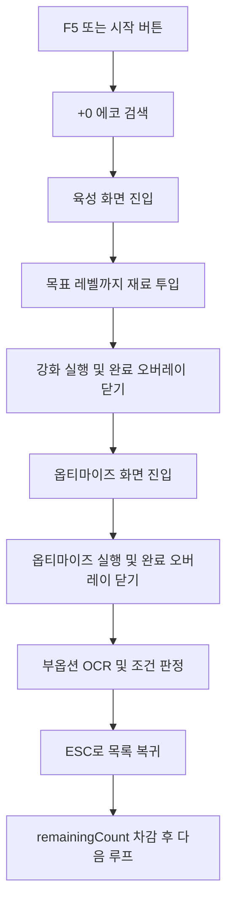

# 자동화 동작 시나리오

이 문서는 캘리브레이션이 모두 끝난 뒤, `wuwa-echo-craftsman`이 실제로 어떤 순서로 동작하려는지 정리한 문서다.

## 1. 실행 전 전제

자동화 시작 전 사용자는 명조를 아래 상태로 준비한다.

- 화면 모드는 `전체 창모드(Borderless Windowed)`를 권장한다.
- 게임은 `에코 목록 화면`에 있어야 한다.
- 목표 세트/코스트/주옵 등 사용자가 원하는 필터는 미리 적용되어 있어야 한다.
- 정렬은 `레벨 순서(오름차순)` 기준으로 맞춘다.
- 자동화 대상은 목록에 보이는 `+0` 에코다.
- 메인 화면에는 목표 레벨, 반복 횟수, 옵티마이즈 시행 횟수만 기본 설정으로 노출한다.
- 시작 전 딜레이, 클릭 후 대기, 완료 오버레이 대기, 사용할 음파통 영역 수, 음파통 클릭 주기는 상세 설정에서 조정한다.
- 옵티마이즈 시행 횟수 `+/-` 버튼 클릭 주기도 상세 설정에서 별도로 조정한다.
- `폐기 에코 강화재료로 사용`이 꺼져 있으면 폐기 에코 탐색을 건너뛰고 음파통만 사용한다.
- 부옵션 판정 조건은 `부옵션 설정` 창에서 별도로 관리한다.

`Dry-run`이 켜져 있으면 실제 클릭/키 입력은 보내지 않고 로그만 남긴다.

## 1.1. 입력과 핫키 주의

- 실제 클릭 테스트 전에는 `Dry-run`을 끄고 `단계 테스트` 버튼으로 한 단계씩 확인한다.
- 앱은 단계 테스트나 자동화 시작 전 설정된 딜레이 동안 창을 숨긴다. 이 시간 안에 명조 창을 포커스해야 한다.
- 실제 클릭 로그에는 `MouseMoveAbsolute`, `MouseLeftDown`, `MouseLeftUp`의 성공 여부와 Win32 error code가 남는다.
- 마우스 이동은 `SendInput`의 `MOUSEEVENTF_MOVE | MOUSEEVENTF_ABSOLUTE | MOUSEEVENTF_VIRTUALDESK` 조합으로 전송한다. 좌표는 가상 데스크톱 기준 0~65535 범위로 정규화한다.
- 명조 창이 관리자 권한 또는 더 높은 무결성 수준으로 실행 중이면, 일반 권한 앱의 `SendInput`이나 글로벌 핫키가 무시될 수 있다. 앱 manifest는 `requireAdministrator`로 설정되어 있으므로 실행 시 UAC 승인이 필요하다.
- 게임 클라이언트가 F5를 직접 소비하거나 차단하면 `RegisterHotKey` 기반 F5가 들어오지 않을 수 있다. 이 경우 메인 창의 `자동화 시작` 버튼 또는 트레이 메뉴를 사용하고, 시작 전 딜레이 동안 명조 창을 포커스한다.
- F6도 같은 제약을 받을 수 있으므로, 위험 테스트 전에는 마우스 `(0, 0)` Fail-safe가 동작하는지 먼저 확인한다.

## 2. 초기 설정 항목

초기 설정은 `초기 설정 관리` 창에서 항목별로 확인하고 수정한다. 전체를 다시 할 필요 없이, 잘못 지정한 항목만 다시 캡처할 수 있다.

### 2.1. 에코 목록 화면

에코 목록 화면에서 수집하는 항목이다.

- `roi_list`: +0 에코를 찾을 에코 썸네일 목록 영역
- `template_plus_zero.png`: +0 표시 이미지
- `roi_enhance_tab`: 에코 선택 후 육성 화면으로 들어가는 버튼 클릭 영역

자동화는 `roi_list` 안에서 `template_plus_zero.png` 후보를 모두 이미지 매칭으로 찾고, 위쪽 행을 우선하며 같은 행에서는 왼쪽을 우선해 클릭한다. 그 뒤 `roi_enhance_tab` 중앙을 클릭한다.

### 2.2. 에코 강화 기본 화면

에코 강화 화면에 들어온 직후 수집하는 항목이다.

- `roi_expected_level`: 재료 투입 후 도달할 예상 레벨 OCR 영역
- `roi_slot_plus`: 재료 투입 영역 또는 재료 슬롯 + 버튼 클릭 영역
- `roi_enhance_confirm`: 강화 실행/확인 버튼 클릭 영역
- `roi_discard_material_confirm`: 폐기 에코를 강화 재료로 사용할 때 뜨는 확인창의 수락 버튼 영역
- `roi_enhance_complete_close`: 강화 완료 오버레이를 닫기 위한 안전 클릭 영역
- `roi_optimize_tab`: 옵티마이즈/튜닝 탭 클릭 영역

`roi_expected_level`은 현재 레벨이 아니라, 재료를 넣었을 때 강화 후 도달할 예상 레벨을 읽기 위한 영역이다.

### 2.3. 에코 강화 재료 리스트 화면

강화 기본 화면에서 `roi_slot_plus` 또는 재료 투입 영역을 눌러 우측 재료 리스트가 열린 상태에서 수집하는 항목이다.

- `roi_material`: 폐기 에코 아이콘을 찾을 재료 리스트 영역
- `icon_discard.png`: 폐기 에코/휴지통 아이콘 이미지
- `roi_exp_material_1`: 사용할 음파통 1 클릭 영역
- `roi_exp_material_2`: 사용할 음파통 2 클릭 영역
- `roi_exp_material_3`: 사용할 음파통 3 클릭 영역
- `roi_exp_material_4`: 사용할 음파통 4 클릭 영역

자동화는 `폐기 에코 강화재료로 사용`이 켜져 있으면 먼저 `roi_material` 안에서 `icon_discard.png`를 이미지 매칭한다. 폐기 에코가 보이면 해당 아이콘 위치를 클릭한다. 폐기 에코가 없거나 폐기 에코 사용이 꺼져 있으면 상세 설정의 `사용할 음파통 영역 수`만큼 `roi_exp_material_1`부터 순서대로 사용한다. 예를 들어 값이 1이면 `roi_exp_material_1`만 반복 사용한다.

### 2.4. 에코 옵티마이즈 화면

옵티마이즈/튜닝 탭으로 이동한 상태에서 수집하는 항목이다.

- `roi_substat`: 부옵션 텍스트 OCR 영역
- `roi_optimize_count`: `옵티마이즈 횟수: n` 텍스트 OCR 영역
- `roi_optimize_minus`: 옵티마이즈 시행 횟수 - 버튼 클릭 영역
- `roi_optimize_plus`: 옵티마이즈 시행 횟수 + 버튼 클릭 영역
- `roi_optimize_confirm`: 옵티마이즈 실행/해금 버튼 클릭 영역
- `roi_optimize_complete_close`: 옵티마이즈 완료 오버레이를 닫기 위한 안전 클릭 영역

옵티마이즈가 끝난 뒤에는 `roi_substat`을 OCR로 읽고, 사용자가 설정한 부옵션 조건과 비교한다.

## 3. 자동화 1회 처리 흐름

자동화 한 사이클은 하나의 +0 에코를 선택하고, 목표 레벨까지 강화한 뒤, 옵티마이즈 결과를 판정하고 목록으로 돌아오는 흐름이다.

## 4. 단계별 상세 동작

### 4.1. SEARCH

1. `roi_list` 영역을 캡처한다.
2. 캡처 이미지 안에서 `template_plus_zero.png` 후보를 모두 찾는다.
3. 후보를 `Y 좌표 -> X 좌표` 순으로 정렬해 가장 위, 가장 왼쪽의 +0 에코를 선택한다.
4. `roi_enhance_tab` 중앙을 클릭해 강화 화면으로 들어간다.
5. +0 표시를 찾지 못하면 더 이상 처리할 에코가 없다고 보고 정상 종료한다.

### 4.2. ENHANCE

1. SEARCH 단계에서 들어온 에코는 +0이라고 전제한다.
2. 따라서 처음부터 `roi_expected_level`을 읽지 않고, 먼저 `roi_slot_plus` 중앙을 클릭해 재료 리스트를 연다.
3. `roi_material` 안에서 `icon_discard.png`를 찾는다.
4. 폐기 에코가 있으면 그 위치를 클릭한다.
5. 폐기 에코가 없거나 폐기 에코 사용이 꺼져 있으면 `roi_exp_material_1`~`roi_exp_material_4` 중 설정된 음파통 영역을 목표 레벨별 추천 횟수만큼 빠르게 클릭한다.
   - 10레벨 목표: 4회
   - 15레벨 목표: 8회
   - 20레벨 목표: 16회
   - 25레벨 목표: 29회
6. 재료가 들어간 뒤 `roi_expected_level`을 OCR로 읽는다.
7. 예상 레벨이 목표 레벨 이상이면:
   - `ESC`를 1회 입력해 재료 선택장을 닫는다.
   - 짧게 대기한다.
   - `roi_enhance_confirm` 중앙을 클릭한다.
   - 이번 강화에 폐기 에코가 포함되었다면 `roi_discard_material_confirm` 중앙을 클릭해 폐기 에코 재료 사용 확인창을 수락한다.
   - 잠시 대기한다.
   - `roi_enhance_complete_close` 중앙을 클릭해 강화 완료 오버레이를 닫는다.
   - 옵티마이즈 단계로 이동한다.
8. 예상 레벨이 목표 레벨보다 낮으면 다시 재료 투입으로 돌아간다.
9. 재료 클릭을 5회 이상 했는데도 예상 레벨이 증가하지 않으면, 재료 부족 또는 클릭 실패로 보고 오류를 기록한 뒤 중단한다.
10. 강화 시도 반복 제한을 넘거나 필수 재료 영역이 설정되지 않았으면 오류로 중단한다.

## 5. OPTIMIZE

1. `roi_optimize_tab` 중앙을 클릭해 옵티마이즈 화면으로 이동한다.
2. `roi_substat`의 기존 OCR 결과를 저장한다. +0 에코를 방금 강화한 상태라면 이 영역은 비어 있을 수 있다.
3. `roi_optimize_count`를 OCR로 읽어 현재 옵티마이즈 시행 횟수를 확인한다.
4. 현재 횟수와 목표 시행 횟수의 차이만큼 `roi_optimize_plus` 또는 `roi_optimize_minus`를 빠르게 연속 클릭한다.
5. 연속 클릭 후 `roi_optimize_count`를 다시 OCR로 읽어 목표 시행 횟수가 되었는지 검증한다.
6. 일정 횟수 안에 목표 시행 횟수를 맞추지 못하면 오류를 기록하고 중단한다.
7. 목표 시행 횟수가 확인되면 `roi_optimize_confirm` 중앙을 클릭한다.
8. 잠시 대기한다.
9. `roi_optimize_complete_close` 중앙을 클릭해 옵티마이즈 완료 오버레이를 닫는다.
10. 다시 `roi_substat`을 OCR한다.
11. 이전 OCR 결과와 달라졌으면 옵티마이즈가 완료된 것으로 보고 판정 단계로 이동한다.

## 6. EVALUATE

1. `roi_substat` 영역을 OCR로 읽는다.
2. OCR 문자열에서 공백/특수문자를 제거하고, 13종 부옵션 표준명으로 정규화한다.
3. OCR 결과는 부옵션 이름 줄과 수치 줄이 분리되어 들어오는 것으로 본다.
   - 예: 부옵션 5개면 0~4번째 유효 줄에 부옵션명이 나오고, 그 뒤 5~9번째 유효 줄에 수치가 같은 순서로 나온다.
   - 부옵션 앞의 장식 문자는 `+`, `十`, 콤마 등으로 오인식될 수 있으므로 정규화 단계에서 무시한다.
4. 파서는 부옵션명으로 인식된 줄을 먼저 모으고, 숫자/퍼센트 줄을 별도로 모은 뒤 같은 순서끼리 묶는다.
5. 사용자가 체크한 부옵션과 Min 수치 조건을 비교한다.
6. `필수`로 체크된 부옵션은 모두 존재하고 Min 조건을 만족해야 한다.
7. `사용`으로 체크된 부옵션은 전체 유효 개수 계산에 포함된다. 필수 부옵션도 사용 부옵션으로 같이 계산된다.
8. 필수 조건이 모두 만족되고, 전체 유효 부옵션 개수가 목표 개수 이상이면 `C`를 입력해 잠금 처리한다.
9. 필수 조건이 하나라도 빠지거나 전체 유효 개수가 부족하면 `Z`를 입력해 폐기 처리한다.
10. OCR 원문, 판정 결과, 유효 개수, 시간 정보를 SQLite 히스토리에 저장한다.

## 6.1. 부옵션 설정

`부옵션 설정` 창은 옵티마이즈 후 잠금/폐기 판정에 필요한 설정을 모은다.

- `잠금을 위한 최소 유효 부옵션 개수`: 조건을 만족해야 하는 전체 유효 부옵션 개수다. 0~5 사이로 보정된다.
- `사용`: 전체 유효 개수 계산에 포함할 부옵션이다.
- `필수`: 반드시 포함되어야 하는 부옵션이다. 필수 체크 시 사용도 자동 체크되며, 필수 상태에서는 사용을 끌 수 없다.
- `최소 수치`: 각 부옵션별 최소 유효 수치다. 비워두면 해당 부옵션의 최저값을 사용한다.
- 최소 수치가 허용 범위를 벗어나면 저장 시 해당 부옵션의 Min/Max 범위 안으로 자동 보정한다.

예를 들어 최소 유효 부옵션 개수가 3이고, 필수 2개와 사용 3개를 설정했다면 필수 2개는 반드시 있어야 한다. 필수 2개가 모두 있고, 사용만 체크된 3개 중 1개 이상이 추가로 조건을 만족하면 총 유효 3개가 되어 잠금 대상이 된다.

## 7. RETURN

1. `ESC`를 입력해 에코 목록으로 돌아간다.
2. `remainingCount`를 1 차감한다.
3. 남은 횟수가 0이면 정상 종료한다.
4. 남은 횟수가 있으면 다시 SEARCH 단계로 돌아간다.

## 8. 중단 조건

자동화는 아래 상황에서 멈춘다.

- 사용자가 `F6`을 누른 경우
- 사용자가 마우스를 화면 좌측 상단 `(0, 0)`으로 이동한 경우
- `remainingCount`가 0이 된 경우
- `roi_list`에서 +0 에코를 더 이상 찾지 못한 경우
- 재료를 찾지 못하거나 필수 ROI/asset이 설정되지 않은 경우
- 재료 클릭을 5회 이상 했는데도 강화 후 예상 레벨이 증가하지 않은 경우
- 옵티마이즈 시행 횟수를 목표값으로 맞추지 못한 경우
- OCR 또는 이미지 매칭이 반복적으로 실패한 경우

## 9. 현재 설계상 주의점

- `roi_expected_level`은 “현재 레벨”이 아니라 “강화 후 예상 레벨”을 읽어야 한다.
- `roi_expected_level`은 재료를 넣은 뒤에 의미가 있다. +0 에코에 들어온 직후 바로 읽는 값은 자동화 판단에 쓰지 않는다.
- `roi_optimize_count`는 `옵타마이즈 횟수:•1`, `옵티마이즈횟수: 3`, `옵터마이즈횟수: 5`처럼 흔들릴 수 있으므로 문자열 전체를 믿지 않고 1~5 사이 숫자만 추출한다.
- `roi_substat`은 부옵션명과 수치가 다른 줄 블록으로 들어온다. 수치가 이름과 같은 줄에 붙어 있을 것이라고 가정하면 안 된다.
- 고정 버튼은 대부분 이미지 매칭이 아니라 ROI 중앙 클릭으로 처리한다.
- 이미지 매칭은 현재 `+0 표시`와 `폐기 에코 아이콘`에 주로 사용한다.
- 음파통은 이미지 매칭하지 않고, 사용자가 지정한 1~4개 영역을 순서대로 클릭한다.
- 실제 클릭 전에는 Dry-run으로 좌표와 상태 전환 로그를 먼저 검증하는 것이 좋다.
