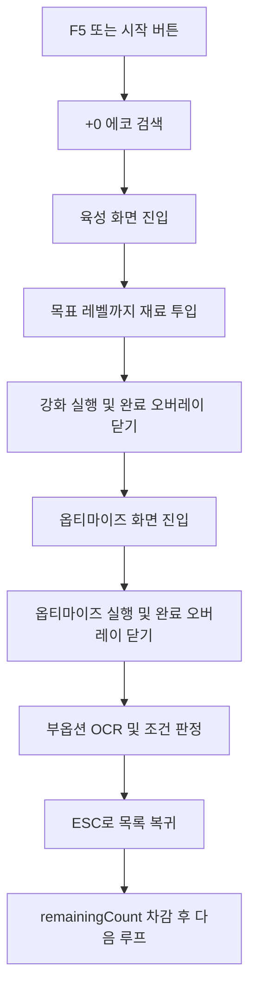

# 자동화 동작 시나리오

이 문서는 캘리브레이션이 모두 끝난 뒤, `wuwa-echo-craftsman`이 실제로 어떤 순서로 동작하려는지 정리한 문서다.

## 1. 실행 전 전제

자동화 시작 전 사용자는 명조를 아래 상태로 준비한다.

- 화면 모드는 `전체 창모드(Borderless Windowed)`를 권장한다.
- 게임은 `에코 목록 화면`에 있어야 한다.
- 목표 세트/코스트/주옵 등 사용자가 원하는 필터는 미리 적용되어 있어야 한다.
- 정렬은 `레벨 순서(오름차순)` 기준으로 맞춘다.
- 자동화 대상은 목록에 보이는 `+0` 에코다.
- 앱에서는 목표 레벨, 반복 횟수, 부옵션 조건, Dry-run 여부를 설정한다.

`Dry-run`이 켜져 있으면 실제 클릭/키 입력은 보내지 않고 로그만 남긴다.

## 2. 초기 설정 항목

초기 설정은 `초기 설정 관리` 창에서 항목별로 확인하고 수정한다. 전체를 다시 할 필요 없이, 잘못 지정한 항목만 다시 캡처할 수 있다.

### 2.1. 에코 목록 화면

에코 목록 화면에서 수집하는 항목이다.

- `roi_list`: +0 에코를 찾을 에코 썸네일 목록 영역
- `template_plus_zero.png`: +0 표시 이미지
- `roi_enhance_tab`: 에코 선택 후 육성 화면으로 들어가는 버튼 클릭 영역

자동화는 `roi_list` 안에서 `template_plus_zero.png`를 이미지 매칭으로 찾고, 찾은 위치를 클릭한 뒤 `roi_enhance_tab` 중앙을 클릭한다.

### 2.2. 에코 강화 기본 화면

에코 강화 화면에 들어온 직후 수집하는 항목이다.

- `roi_expected_level`: 재료 투입 후 도달할 예상 레벨 OCR 영역
- `roi_slot_plus`: 재료 투입 영역 또는 재료 슬롯 + 버튼 클릭 영역
- `roi_enhance_confirm`: 강화 실행/확인 버튼 클릭 영역
- `roi_enhance_complete_close`: 강화 완료 오버레이를 닫기 위한 안전 클릭 영역
- `roi_optimize_tab`: 옵티마이즈/튜닝 탭 클릭 영역

`roi_expected_level`은 현재 레벨이 아니라, 재료를 넣었을 때 강화 후 도달할 예상 레벨을 읽기 위한 영역이다.

### 2.3. 에코 강화 재료 리스트 화면

강화 기본 화면에서 `roi_slot_plus` 또는 재료 투입 영역을 눌러 우측 재료 리스트가 열린 상태에서 수집하는 항목이다.

- `roi_material`: 폐기 에코 아이콘을 찾을 재료 리스트 영역
- `icon_discard.png`: 폐기 에코/휴지통 아이콘 이미지
- `roi_exp_material_1`: 사용할 음파통 1 클릭 영역
- `roi_exp_material_2`: 사용할 음파통 2 클릭 영역
- `roi_exp_material_3`: 사용할 음파통 3 클릭 영역
- `roi_exp_material_4`: 사용할 음파통 4 클릭 영역

자동화는 먼저 `roi_material` 안에서 `icon_discard.png`를 이미지 매칭한다. 폐기 에코가 보이면 해당 아이콘 위치를 클릭한다. 폐기 에코가 없으면 설정된 음파통 영역들을 순서대로 중앙 클릭한다.

### 2.4. 에코 옵티마이즈 화면

옵티마이즈/튜닝 탭으로 이동한 상태에서 수집하는 항목이다.

- `roi_substat`: 부옵션 텍스트 OCR 영역
- `roi_optimize_confirm`: 옵티마이즈 실행/해금 버튼 클릭 영역
- `roi_optimize_complete_close`: 옵티마이즈 완료 오버레이를 닫기 위한 안전 클릭 영역

옵티마이즈가 끝난 뒤에는 `roi_substat`을 OCR로 읽고, 사용자가 설정한 부옵션 조건과 비교한다.

## 3. 자동화 1회 처리 흐름

자동화 한 사이클은 하나의 +0 에코를 선택하고, 목표 레벨까지 강화한 뒤, 옵티마이즈 결과를 판정하고 목록으로 돌아오는 흐름이다.

## 4. 단계별 상세 동작

### 4.1. SEARCH

1. `roi_list` 영역을 캡처한다.
2. 캡처 이미지 안에서 `template_plus_zero.png`를 찾는다.
3. +0 표시를 찾으면 해당 좌표를 클릭해 에코를 선택한다.
4. `roi_enhance_tab` 중앙을 클릭해 강화 화면으로 들어간다.
5. +0 표시를 찾지 못하면 더 이상 처리할 에코가 없다고 보고 정상 종료한다.

### 4.2. ENHANCE

1. `roi_expected_level`을 OCR로 읽는다.
2. 예상 레벨이 목표 레벨 이상이면:
   - `roi_enhance_confirm` 중앙을 클릭한다.
   - 잠시 대기한다.
   - `roi_enhance_complete_close` 중앙을 클릭해 강화 완료 오버레이를 닫는다.
   - 옵티마이즈 단계로 이동한다.
3. 예상 레벨이 목표 레벨보다 낮으면:
   - `roi_slot_plus` 중앙을 클릭해 재료 리스트를 연다.
   - `roi_material` 안에서 `icon_discard.png`를 찾는다.
   - 폐기 에코가 있으면 그 위치를 클릭한다.
   - 폐기 에코가 없으면 `roi_exp_material_1`~`roi_exp_material_4` 중 설정된 영역을 순서대로 클릭한다.
   - 다시 `roi_expected_level` OCR로 돌아간다.
4. 강화 시도 반복 제한을 넘거나 재료 영역이 설정되지 않았으면 오류로 중단한다.

## 5. OPTIMIZE

1. `roi_optimize_tab` 중앙을 클릭해 옵티마이즈 화면으로 이동한다.
2. `roi_substat`의 기존 OCR 결과를 저장한다.
3. `roi_optimize_confirm` 중앙을 클릭한다.
4. 잠시 대기한다.
5. `roi_optimize_complete_close` 중앙을 클릭해 옵티마이즈 완료 오버레이를 닫는다.
6. 다시 `roi_substat`을 OCR한다.
7. 이전 OCR 결과와 달라졌으면 옵티마이즈가 완료된 것으로 보고 판정 단계로 이동한다.

## 6. EVALUATE

1. `roi_substat` 영역을 OCR로 읽는다.
2. OCR 문자열에서 공백/특수문자를 제거하고, 13종 부옵션 표준명으로 정규화한다.
3. 사용자가 체크한 부옵션과 Min 수치 조건을 비교한다.
4. 유효 부옵션 개수가 목표 개수 이상이면 `C`를 입력해 잠금 처리한다.
5. 조건 미달이면 `Z`를 입력해 폐기 처리한다.
6. OCR 원문, 판정 결과, 유효 개수, 시간 정보를 SQLite 히스토리에 저장한다.

## 7. RETURN

1. `ESC`를 입력해 에코 목록으로 돌아간다.
2. `remainingCount`를 1 차감한다.
3. 남은 횟수가 0이면 정상 종료한다.
4. 남은 횟수가 있으면 다시 SEARCH 단계로 돌아간다.

## 8. 중단 조건

자동화는 아래 상황에서 멈춘다.

- 사용자가 `F6`을 누른 경우
- 사용자가 마우스를 화면 좌측 상단 `(0, 0)`으로 이동한 경우
- `remainingCount`가 0이 된 경우
- `roi_list`에서 +0 에코를 더 이상 찾지 못한 경우
- 재료를 찾지 못하거나 필수 ROI/asset이 설정되지 않은 경우
- OCR 또는 이미지 매칭이 반복적으로 실패한 경우

## 9. 현재 설계상 주의점

- `roi_expected_level`은 “현재 레벨”이 아니라 “강화 후 예상 레벨”을 읽어야 한다.
- 고정 버튼은 대부분 이미지 매칭이 아니라 ROI 중앙 클릭으로 처리한다.
- 이미지 매칭은 현재 `+0 표시`와 `폐기 에코 아이콘`에 주로 사용한다.
- 음파통은 이미지 매칭하지 않고, 사용자가 지정한 1~4개 영역을 순서대로 클릭한다.
- 실제 클릭 전에는 Dry-run으로 좌표와 상태 전환 로그를 먼저 검증하는 것이 좋다.
