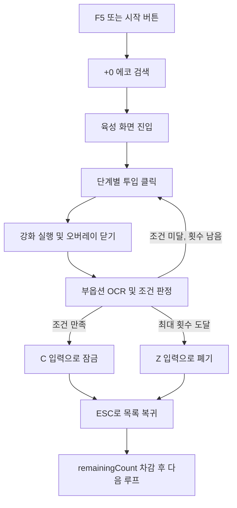

# 자동화 동작 시나리오

이 문서는 캘리브레이션이 모두 끝난 뒤, `wuwa-echo-craftsman`이 실제로 어떤 순서로 동작하는지 정리한 문서다.

## 1. 실행 전 전제

자동화 시작 전 사용자는 명조를 아래 상태로 준비한다.

- 화면 모드는 `전체 창모드(Borderless Windowed)`를 권장한다.
- 게임은 `에코 목록 화면`에 있어야 한다.
- 목표 세트/코스트/주옵 등 사용자가 원하는 필터는 미리 적용되어 있어야 한다.
- 정렬은 `레벨 순서(오름차순)` 기준으로 맞춘다.
- 자동화 대상은 목록에 보이는 `+0` 에코다.
- 인게임 `자동 투입 설정`은 `단계별 투입`, `옵티마이즈 동기화 켜기`, `강화 재료 및 에코`로 미리 맞춘다.
- 메인 화면에서 사용자는 `옵티마이즈 최대 시행 횟수(1~5)`를 지정한다. 목표 레벨은 이 값에 5를 곱한 읽기 전용 값으로 표시된다.
- 부옵션 판정 조건은 `부옵션 설정` 창에서 별도로 관리한다.

`Dry-run`이 켜져 있으면 실제 클릭/키 입력은 보내지 않고 로그만 남긴다.

## 2. 초기 설정 항목

초기 설정은 `초기 설정 관리` 창에서 항목별로 확인하고 수정한다. 전체를 다시 할 필요 없이, 잘못 지정한 항목만 다시 캡처할 수 있다.

### 2.1. 에코 목록 화면

- `roi_list`: +0 에코를 찾을 에코 썸네일 목록 영역
- `template_plus_zero.png`: +0 표시 이미지
- `roi_enhance_tab`: 에코 선택 후 육성 화면으로 들어가는 버튼 클릭 영역

자동화는 `roi_list` 안에서 `template_plus_zero.png` 후보를 모두 이미지 매칭으로 찾고, 위쪽 행을 우선하며 같은 행에서는 왼쪽을 우선해 클릭한다. 그 뒤 `roi_enhance_tab` 중앙을 클릭한다.

### 2.2. 에코 강화 화면

- `roi_staged_auto_input`: 단계별 투입 버튼 클릭 영역
- `roi_enhance_confirm`: 강화 실행/확인 버튼 클릭 영역
- `roi_enhance_complete_close`: 강화 완료 오버레이를 닫기 위한 안전 클릭 영역
- `roi_substat`: 강화 화면에 표시되는 부옵션 텍스트 OCR 영역

자동화는 더 이상 재료 리스트를 열거나 옵티마이즈/튜닝 탭으로 이동하지 않는다.

## 3. 자동화 1회 처리 흐름

자동화 한 사이클은 하나의 +0 에코를 선택하고, 에코 강화 화면에서 단계별 강화와 부옵션 판정을 반복한 뒤 잠금/폐기하고 목록으로 돌아오는 흐름이다.

```mermaid
flowchart TD
    Start["F5 또는 시작 버튼"] --> Search["+0 에코 검색"]
    Search --> EnhanceTab["육성 화면 진입"]
    EnhanceTab --> StagedInput["단계별 투입 클릭"]
    StagedInput --> EnhanceConfirm["강화 실행 및 오버레이 닫기"]
    EnhanceConfirm --> Evaluate["부옵션 OCR 및 조건 판정"]
    Evaluate -->|"조건 만족"| Lock["C 입력으로 잠금"]
    Evaluate -->|"조건 미달, 횟수 남음"| StagedInput
    Evaluate -->|"최대 횟수 도달"| Discard["Z 입력으로 폐기"]
    Lock --> Return["ESC로 목록 복귀"]
    Discard --> Return
    Return --> Next["remainingCount 차감 후 다음 루프"]
```

## 4. 단계별 상세 동작

### 4.1. SEARCH

1. `roi_list` 영역을 캡처한다.
2. 캡처 이미지 안에서 `template_plus_zero.png` 후보를 모두 찾는다.
3. 후보를 `Y 좌표 -> X 좌표` 순으로 정렬해 가장 위, 가장 왼쪽의 +0 에코를 선택한다.
4. `roi_enhance_tab` 중앙을 클릭해 강화 화면으로 들어간다.
5. +0 표시를 찾지 못하면 더 이상 처리할 에코가 없다고 보고 정상 종료한다.

### 4.2. STAGED_ENHANCE

1. `roi_staged_auto_input` 중앙을 클릭한다.
2. 짧게 대기한 뒤 `roi_enhance_confirm` 중앙을 클릭한다.
3. 강화 성공 오버레이가 뜰 시간을 기다린 뒤 `roi_enhance_complete_close` 중앙을 클릭해 닫는다.
4. 같은 강화 화면의 `roi_substat` 영역을 OCR로 읽는다.
5. 사용자가 설정한 부옵션 조건을 만족하면 즉시 `C`를 입력해 잠금 처리한다.
6. 조건을 만족하지 않았고 최대 시행 횟수가 남아 있으면 1번으로 돌아간다.
7. 최대 시행 횟수까지 조건을 만족하지 못하면 `Z`를 입력해 폐기 처리한다.
8. 잠금/폐기 후 OCR 원문, 판정 결과, 유효 개수, 시간 정보를 SQLite 히스토리에 저장한다.

## 5. 부옵션 판정

1. `roi_substat` 영역을 OCR로 읽는다.
2. OCR 문자열에서 공백/특수문자를 제거하고, 13종 부옵션 표준명으로 정규화한다.
3. OCR 결과는 부옵션 이름 줄과 수치 줄이 분리되어 들어오는 것으로 본다.
4. 파서는 부옵션명으로 인식된 줄을 먼저 모으고, 숫자/퍼센트 줄을 별도로 모은 뒤 같은 순서끼리 묶는다.
5. 사용자가 체크한 부옵션과 Min 수치 조건을 비교한다.
6. `필수`로 체크된 부옵션은 모두 존재하고 Min 조건을 만족해야 한다.
7. `사용`으로 체크된 부옵션은 전체 유효 개수 계산에 포함된다. 필수 부옵션도 사용 부옵션으로 같이 계산된다.
8. 필수 조건이 모두 만족되고, 전체 유효 부옵션 개수가 목표 개수 이상이면 잠금 대상이다.

## 6. RETURN

1. 잠금 또는 폐기 입력 뒤 `ESC`를 입력해 에코 목록으로 돌아간다.
2. `remainingCount`를 1 차감한다.
3. 남은 횟수가 0이면 정상 종료한다.
4. 남은 횟수가 있으면 다시 SEARCH 단계로 돌아간다.

## 7. 중단 조건

자동화는 아래 상황에서 멈춘다.

- 사용자가 `F6`을 누른 경우
- 사용자가 마우스를 화면 좌측 상단 `(0, 0)`으로 이동한 경우
- `remainingCount`가 0이 된 경우
- `roi_list`에서 +0 에코를 더 이상 찾지 못한 경우
- 필수 ROI/asset이 설정되지 않은 경우
- OCR 또는 이미지 매칭이 반복적으로 실패한 경우

## 8. 현재 설계상 주의점

- 인게임 자동 투입 설정이 맞지 않으면 `roi_staged_auto_input` 클릭 이후 의도한 강화 재료가 들어가지 않을 수 있다.
- `roi_substat`은 강화 화면에 표시되는 부옵션 영역을 지정해야 한다. 옵티마이즈 탭으로 이동하지 않는다.
- 고정 버튼은 대부분 이미지 매칭이 아니라 ROI 중앙 클릭으로 처리한다.
- 이미지 매칭은 현재 `+0 표시`에 사용한다.
- 실제 클릭 전에는 Dry-run으로 좌표와 상태 전환 로그를 먼저 검증하는 것이 좋다.
